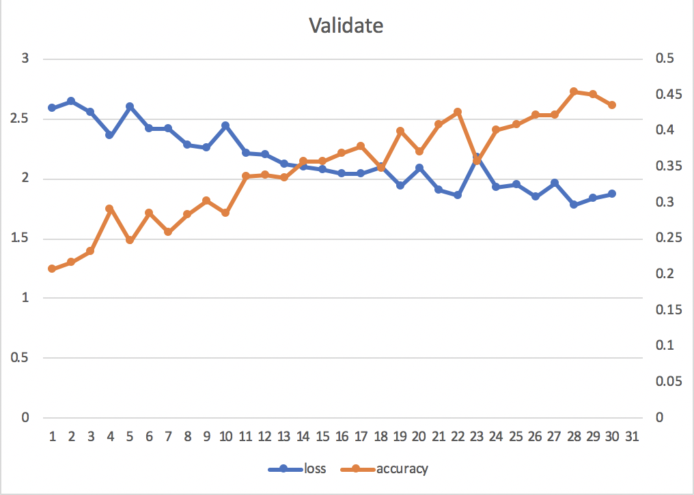

# AutoQA
唱戏给，雄起阿里郎！

## 解决imbalanced dataset的一些方法
updated by xlj on Dec 16
1. sampling一个比例合理的子集作为训练集，或在不同batch中取样比例均衡
https://content.iospress.com/articles/intelligent-data-analysis/ida184327（4.1）

2. 用已有数据生成新的样例，补充minority set
（1）GAN生成
https://linkinghub.elsevier.com/retrieve/pii/S0925231219309257
（2）k-均值聚类+遗传算法
https://ieeexplore.ieee.org/stamp/stamp.jsp?tp=&arnumber=8602972

3. cost-sensitive classifier
给不同类的loss加一个权值，使其有偏向

4. thredshold
在stackoverflow看到的，大概是控制概率输出的范围？？？

## 最新训练曲线

